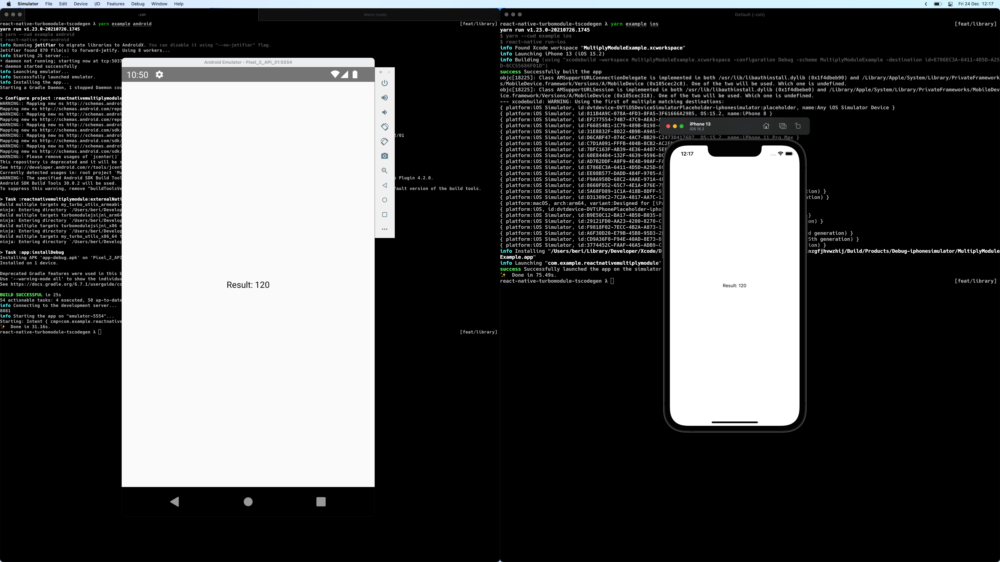

# WORK IN PROGRESS

> iOS simulator and device are working

> Android simulator and device are working

---

# Worlds Fastest rust to React Native Multiply Library



## Description

This is a library which uses [react-native-tscodegen](https://github.com/microsoft/react-native-tscodegen) in combination with [turboModules](https://github.com/react-native-community/discussions-and-proposals/blob/master/proposals/0002-Turbo-Modules.md) and rust!. This demo application simply calls a method registered in rust via c++ from the JS side. It is completely synchronous, it could also be asynchronous, and the performance is rather good.

## Getting started

> TODO

### Generating the framework

```sh
cd multiply
make all
```

This demo is not finished and not perfect. To get started you need to have the react native environment setup complete and some basic knowledge of turbomodules.

clone the project and run the following command:

```sh
yarn && yarn example && pod install --project-directory=example/ios
```

After this you can generate the cpp code using the following command. In the future this will be committed into git, but for now we re-generate it every time.

```sh
yarn tscodegen
```

After this we have to make some minor changes to the generated code. This might
be possible without, but I lack the cpp knowledge to implement this without any
minor changes.

#### lib/cpp-generated/NativeModules.h

We have to make the constructor public and not protected so that we can call it
from a child class.

```diff
 #pragma once

 #include <ReactCommon/TurboModule.h>

 namespace facebook {
 namespace react {
 class JSI_EXPORT MultiplyModuleCxxSpecJSI : public TurboModule {
-protected:
-  MultiplyModuleCxxSpecJSI(std::shared_ptr<CallInvoker> jsInvoker);
 public:
+MultiplyModuleCxxSpecJSI(std::shared_ptr<CallInvoker> jsInvoker);
 virtual double multiply(jsi::Runtime &rt, double a, double b) = 0;

 };

 } // namespace react
 } // namespace facebook

```

#### lib/cpp-generated/NativeModules.cpp

```diff
-#include <react/modules/MultiplyModule/NativeModules.h>
+#include <NativeModules.h>

 namespace facebook {
 namespace react {

 static jsi::Value __hostFunction_MultiplyModuleCxxSpecJSI_multiply(jsi::Runtime &rt, TurboModule &turboModule, const jsi::Value* args, size_t count) {
   return static_cast<MultiplyModuleCxxSpecJSI *>(&turboModule)->multiply(rt, args[0].getNumber(), args[1].getNumber());
 }

 MultiplyModuleCxxSpecJSI::MultiplyModuleCxxSpecJSI(std::shared_ptr<CallInvoker> jsInvoker)
   : TurboModule("MultiplyModule", jsInvoker) {
   methodMap_["multiply"] = MethodMetadata {2, __hostFunction_MultiplyModuleCxxSpecJSI_multiply};
 }


 } // namespace react
 } // namespace facebook
```

We also register the module via the `rt.global.setProperty()` instead of the `RCTCxxModule::createModule()` as I could not get that working

After these changes you can start the example application with the following command:

```sh
yarn example ios
```

This will launch an emulator showing the result of a multiplication of two numbers (insane, I know).

## Credits

- [react-native-builder-bob](https://github.com/callstack/react-native-builder-bob)
  - For instantiating the project
- [react-native-tscodegen](https://github.com/microsoft/react-native-tscodegen)
  - For generating the cpp code
- [discovering-turbomodules](https://github.com/barthap/discovering-turbomodules)
  - For registering the module
